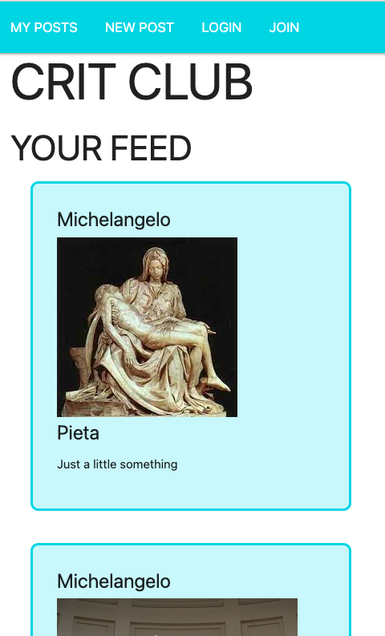
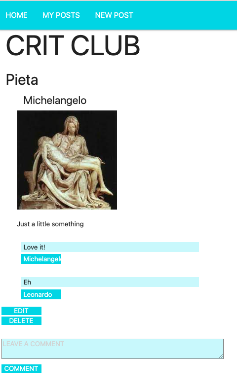
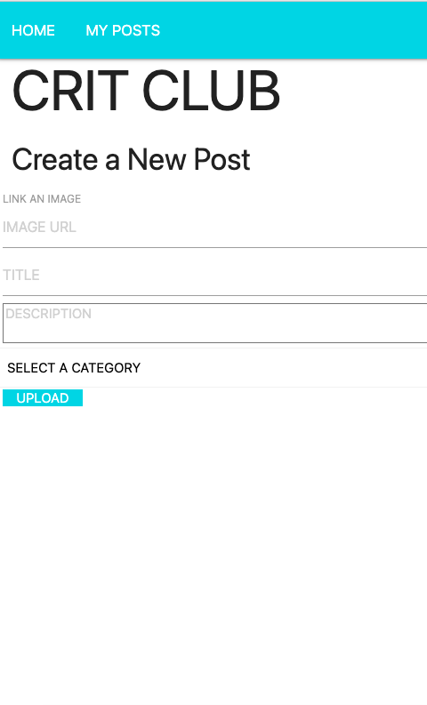
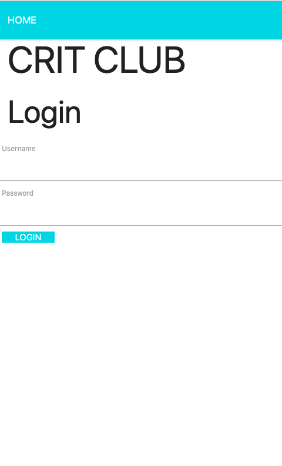

# Crit Club

Are you an artist, just out of college/grad school craving the feedback that you once received daily on your work, or are you just a glutton for punishment? Fear no more, because Crit Club is here! A site where you can post work for your peers to tear apart for your betterment...or detriment. 

On Crit Club you can:
- Post Artwork
- Edit or Delete your posts (let's pretend that art never happened)
- Comment or troll on other's posts 
- Or just lurk and watch the turmoil unfold

# Technologies Used:
- HTML
- CSS
- JavaScript/jQuery
- Node.js
- Express.js/ejs
- Mongoose ODM
- MongoDB

# Screenshots

# How to get started:
click here to get your crit on!

# Future Enhancements:

- up/down votes for posts
- a profile page w/picture 

